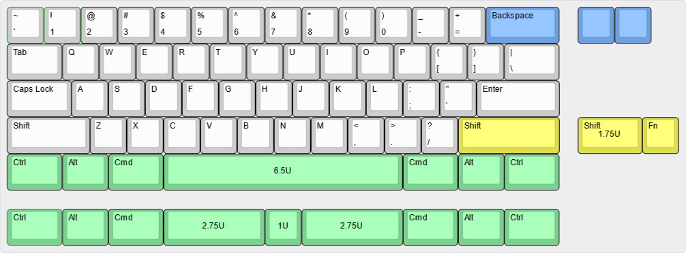
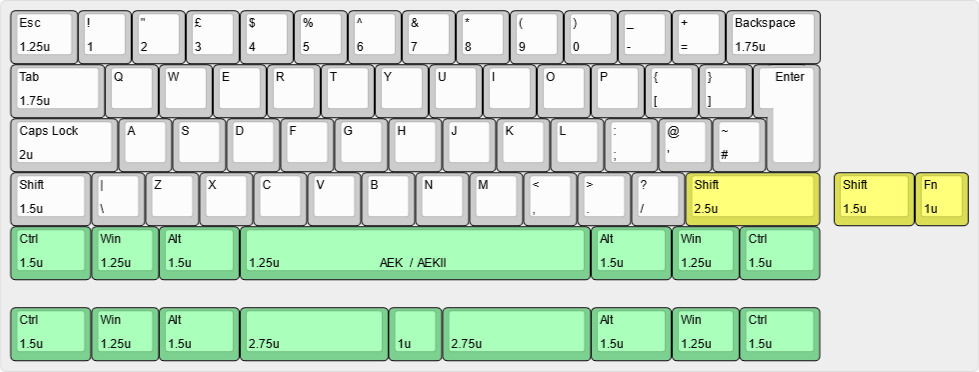

# Unextended keyboard

Welcome to the **Unextended Keyboard** project. The goal of the project is to make a ZMK powered wireless 60% keyboard that targets ALPS switches and specifically the keycaps from Apple Extended Keyboards.

## Disclaimer:
I am not a case designer, this is just a personal project for me to play with 3D CAD. There are likely many best practices that are missing in this project and there are likely many improvements that can be made for better machinability. See this as a work in progress or something to get inspiration from, rather than something production ready.

## Status:
A prototype has been made of the current step model. The PCBs in this repo are currently untested. For the prototype, a cyber60 PCB with the USB-port removed was used. The PCBs share the same pinout and basic functions as the Cyber60 Revision C/D, so the same code can be used for firmware and bootloader if needed. For a QMK based keyboard build, the Waffling60 alps PCB can be used with the USB port removed. PCBs available here: https://4pplet.com/products/waffling60

## Keyboard Parts:
- Case
- PCB + C1 or C3 compatible daughterboard
- 3.7v single cell lipo/liion battery with a 2-pin JST PH connector (check polarity on PCB)
- Plate
- SKUF feet
- O-ring (OD 3.5-3.55MM, Length 175-185mm)
- Cover plate for battery and daughterboard (0.6mm FR4 was used for the protos)
- M2 screws for daughter board and cover plate
- Alps switches, stabs and AEK-keycaps
- 3.7V LiPo Battery (a 3mm thick, 303759 750mAh battery was used for protos: https://www.aliexpress.com/item/33019120350.html)

## Specs:
- 60%
- Bakeneko V3 rubber worm/o-ring mount
- Compatible projects: Cyber60 and Waffling60
- 5.4 degree typing angle

## Todo:
- Make releases for PCB and plates
- Verify PCB designs and implement ZMK (currently, I'd recommend to use the cyber60 for this, untill the undextended PCBs are implemented and tested)
- Overhaul the general design for better machinability.

# Layout support ANSI:

# Layout support ISO:

## Comments on plates:
I have made three different plate designs
- OG ANSI layout
- OG ISO layout
- ANSI layout with split r-shift, split space and split backspace (this is what I'm personally using)

## Revisions:
- P1: 2021-09-20 - 3D printed concept with a bit wider bezels
- P2: 2021-11-18 - Alu CNC proto from PCB way. Slimmed down bezels and added battery cover.
- V1: 2022-01-23 - Second prototype of the case. Changed to V3 Bakeneko mounting posts and recessed and moved down the daughterboard slightly. PCBWay had issues tapping the screw holes closest to the edge for the daugheter board in P2.

## Pic of initial 3D proto (P1):
3d_print

## Pics of initial alu proto (P2):

<a href='https://ko-fi.com/4pplet' target='_blank'>
