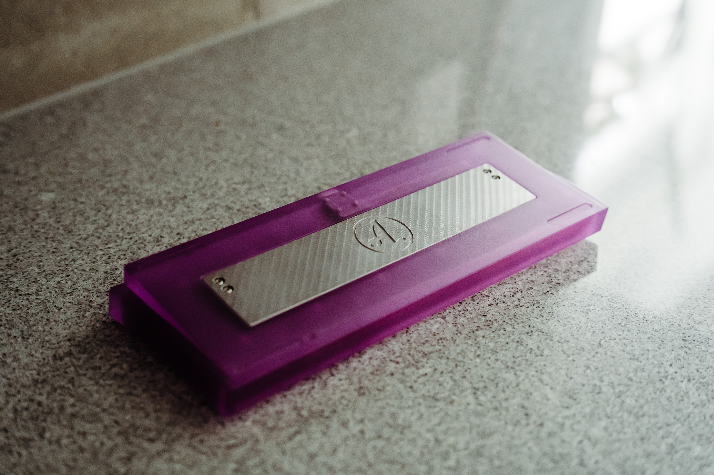

# Unextended keyboard

Welcome to the **Unextended Keyboard** project. A 60% keyboard that targets ALPS switches and specifically the keycaps from Apple Extended Keyboards.

## Disclaimer:
I am not a case designer, this is just a personal project for me to play with 3D CAD. There are likely many best practices that are missing in this project and there are likely many improvements that can be made for better machinability. See this as a work in progress or something to get inspiration from, rather than something production ready.

**If you get these produced in PC, make sure to use threaded insers for the screws.**

## Status:
A V1 prototype has been made by PCBWay of the current V1-step model and a full wireless build have been made with a Cyber60 PCB. A mini-GB has been completed using the FE-step model by Gaoije in both PC and Aluminium and a full wired build have been made with a AEKISO60. For wireless builds I recommend the V1-model and Cyber 60 PCB. For wired builds I recommend the FE-model and either the Waffling60 Alps or the AEKISO60. MX builds can also be used in both V1 and FE cases.

I have also done a slimmer version, called Unextended Standard. This version is designed for use with M0116 or M0118 keycaps and the Unextended Standard PCB: https://github.com/4pplet/Unextended-Standard-PCB. Note: The "Standard" version of the case and PCB is not 60%. For a 60% build, use the Unextended V1 or Unextended FE and a 60% PCB (like the waffling60 alps or aekiso60).

## Keyboard Parts:
- Case
- PCB + C1 or C3 compatible daughterboard
- 3.7v single cell lipo/liion battery with a 2-pin JST PH connector (check polarity on PCB) if wireless.
- Plate
- SKUF feet
- O-ring (OD 3.5-3.55MM, Length 175-185mm)
- Cover plate for battery and daughterboard (0.6mm FR4 was used for the protos) for V1, not strictly needed.
- M2 screws for daughter board and cover plate.
- Alps switches, stabs and AEK-keycaps
- 3.7V LiPo Battery (a 3mm thick, 303759 750mAh battery was used for protos: https://www.aliexpress.com/item/33019120350.html) if wireless.

## Specs:
- V1 and FE: 60%, Standard: 55%
- Bakeneko V3 rubber worm/o-ring mount
- Compatible projects: 
  - Unextended V1 and Unextended FE: Cyber60, Waffling60 and AEKISO60 (USB-port need to be unmounted or desoldered to fit)
  - Unextended Standard FE: Unextended Standard PCB
- 5.4 degree typing angle

## Revisions:
- P1: 2021-09-20 - 3D printed concept with a bit wider bezels
- P2: 2021-11-18 - Alu CNC proto from PCB way. Slimmed down bezels and added battery cover.
- V1: 2022-01-23 - Second prototype of the case. Changed to V3 Bakeneko mounting posts and recessed and moved down the daughterboard slightly. PCBWay had issues tapping the screw holes closest to the edge for the daugheter board in P2.
- FE V1: 2022-09-17 - Reworked case by Laminar, adding a weight and removing channel for battery. This version is not intended for use with a internal battery.
- FE Standard V1: 2022-12-16 - Reworking the case to a slimmer version intended for M0116, M0118, NeXT and IIc keycaps.

## Initial 3D proto (P1):
SLA print from PCBWay
3d_print

## Initial alu proto (P2):
CNCd ALU from PCBWay

## Pics of mini GB of Unextended FE:
CNCd PC from Gaojie

## Initial proto of Unextended Standard:
Modified release for use of M0118 and M0116 keycaps. SLA Print from Gaoije, print from PCBWay also made.

<a href='https://ko-fi.com/4pplet' target='_blank'>
